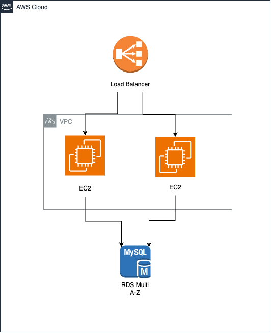

# Esercizio 3
Considerando le specifiche del sistema, ho deciso di utilizzare i seguenti servizi AWS:
* Un'istanza EC2 per ospitare il webserver
* Un'istanza RDS per ospitare il database MySQL

Tra Apache e Nginx ho scelto Nginx per la sua leggerezza e per la sua facilità di configurazione.

## Webserver
Per il webserver, una volta creata l'instanza è sufficiente scaricare ed installare WordPress. Dopo aver installato WordPress, è necessario configurare Nginx per servire il sito. Per farlo è necessario modificare il file di configurazione di Nginx.

## Database
Per il database, scegliendo RDS, è sufficiente selezionare MySQL come motore e configurare quelli che sono i parametri di base per l'autenticazione e la connessione al database. Per la creazione del database, è sufficiente creare un database vuoto e configurare WordPress per utilizzare il database appena creato.

## Specifiche
La scelta delle specifiche per le instanze, dipende da diversi fattori, infatti andrebbe stimato a priori il traffico che questi servizi possono avere, tali per cui si può decidere di allocare più o meno risorse, con relativa differenza di costo.

## Punto 4
Per rendere l'infrastruttura sicura, è necessario configurare un gruppo di sicurezza per l'istanza EC2, in modo tale da permettere solo il traffico HTTP e HTTPS. Inoltre è necessario configurare un gruppo di sicurezza per l'istanza RDS, in modo tale da permettere solo il traffico proveniente dall'istanza EC2 ed evitare accessi non autorizzati. In generale il sistema deve accettare dall'esterno solo il traffico HTTP e HTTPS verso l'istanza EC2 che ospita il webserver.

Per quanto riguarda la tolleranza ai guasti è necessario predisporre il database in modalità multi AZ o cluster multi AZ per fornire HA, ridondanza ed anche "resistere" a carichi di lavoro elevati. Inoltre è necessario che ci sia almeno un'istanza EC2 in più per fornire ridondanza e tolleranza ai guasti.

Per gestire ed adattarsi a variazioni di carico lato web server, è necessario che sia presente un load balancer che distribuisca il carico tra le istanze EC2. Inoltre è necessario che sia presente un sistema di autoscaling per aumentare o diminuire il numero di istanze EC2 in base al carico di lavoro.

## Punto 5
Purtroppo non conosco ancora CloudFormation, Terraform e CDK, quindi non ho potuto utilizzarli per la creazione dell'infrastruttura.

## Diagramma
Il diagramma è stato realizzato usando Draw.io. E' molto semplice, ma credo che sia sufficiente per rappresentare l'infrastruttura descritta, rispecchiando il grado di conoscenza che ho di AWS.

## Considerazioni
In alcuni punti potrei aver utilizzato dei termini non corretti, ma credo che l'idea generale sia quella. Inoltre, non avendo mai utilizzato AWS, potrei aver fatto delle scelte non ottimali per quanto riguarda i servizi da utilizzare.